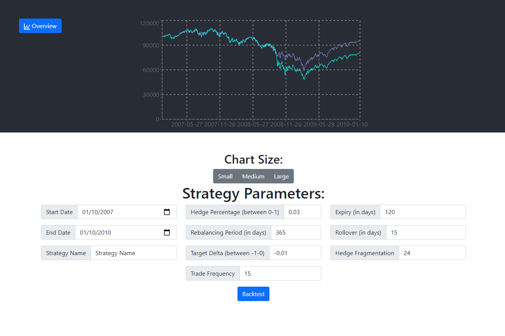

# Stock Options Backtesting Web App

Hi there, 

This is a repository of code I wrote for a freelancing job on backtesting stock options strategies. The client wanted to know the optimal ratio between stock and hedge for a portfolio as well as the optimal parameters regarding the put contracts used for the hedge. This backtesting script allows the user to specify a start and end date for the simulation. The user specifies the percentage of the portfolio value that gets reserved for stock and how much for hedge. The user also specifies the length of the rebalancing period, the desired delta and expiry of the put contracts, holding period of the contract (time till rollover), trade frequency, and degree of fragmentation of the capital reserved for hedge.

## Repository Contents

In the Backend directory you will find:
- The backtesting script (backtester.py)
- Utility functions and classes (functions.py, Portfolio.py)
- Sample input parameters in the form of .json files (params.json)
- A primitive matplotlib script to graph the output (grapher.py)
- A runner script that passes the parameters to the backtesting script and saves the output. (main.py)
- A simple HTTP server that listens to requests, parses the query string, and responds with the result of the backtester. (webserver.py)
- A handful of unit tests for the Portfolio helper class (api_tests.py)

In the Frontend directory you will find a one page React app that allows the user to input the parameters of the backtest, and an area to display the graph of the simulation.

## To run the web application
### Prerequisites

1. To run the backtesting script you will need a dataset of historical stock options prices. This dataset must have the following information associated with the options contracts:
    - underlying_symbol
    - quote_date
    - expiration
    - strike
    - option_type
    - bid_1545
    - ask_1545
    - underlying_bid_1545
    - underlying_ask_1545
    - delta_1545

    Ensure that data is stored at
    
        Stock-Options-Backtesting/Backend/data/

    in .csv format with the columns names as listed above

### Starting the HTTP server
1. Change into the Backend directory

        cd Stock-Options-Backtesting/Backend/V1

2. Install the dependencies

        python3 -m pip install tqdm pandas

3. Ensure that you are hosting the server on the desired host and port. 
4. Ensure that you loading in the data of the correct time period
5. Run the server
        
        python3 webserver.py

### Running the React App

1. Change into the Frontend directory

        cd Stock-Options-Backtesting/Frontend

2. Install npm dependencies

        npm install

3. Ensure that you are fetching results from the host and port that you specified in the HTTP server script. Find these parameters in:

        Stock-Options-Backtesting/Frontend/src/APICaller.js

4. Build and serve the application

        npm run build
        serve -s build

You should now be able to visit localhost:3000 and view the running application

## Possible Improvements

- To add support for backtesting strategies that involve selling options.
